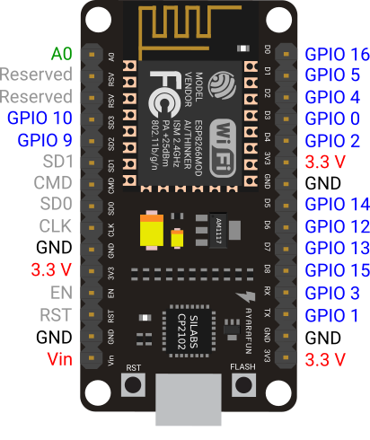
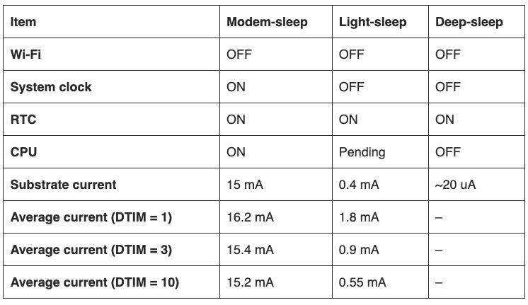
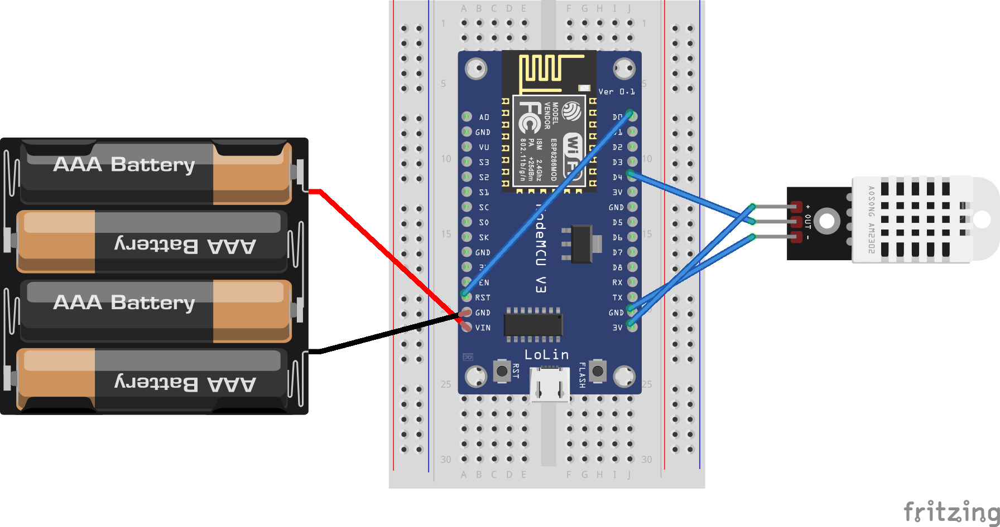
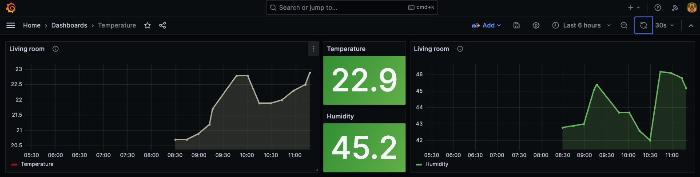

# General

This repo is to help out others that have been looking to create a cheap Thermometer project that runs on batteries and uses WIFI to connect to an InfluxDB/Grafana setup for storing data points and visualizing these data points.

## Requirements Hardware
- a cheap nodemcu clone knockoff bought for a few dollars
- a DHT22 sensor (three pins)
- 4 rechargeable batteries NI-MH 1.2 volts (I used Ladda 2450 Ni-MH from IKEA)
- Some jumper cables to connect stuff to pins
- A case to cover the equipment (i used a simple plastic box)

## Requirements Software
- A running instance of InfluxDB and Grafana
- Arduino IDE for programming the micro controller
- In the Arduino IDE, using the NodeMCU 1.0 (ESP-12E) board
- In the Arduino IDE, using the Serial Port (USB) /dev/cu.wchusbserial110 
- Install the CH340C drivers (I run a Macbook with an M3 chipset) and I needed to download this driver to let it run on my Silicon M3. 
https://github.com/WCHSoftGroup/ch34xser_macos

## NodeMCU clone
Here is the NodeMCU clone, a really cheap knockoff that only costed a couple of dollars.

And the backside with the referral to the installation of the CH340 drivers.

## NodeMCU Pin Layout
Mind you that the NodeMCU Pin Layout is not the same as on the standard Arduinos.

## DHT Sensor
The DHT 22 sensor used has three pins to connect.
- Pin 1 - 3v
- Pin 2 - data
- Pin 3 - ground

## Deep Sleep
Deep Sleep is a great way to conserve your battery power. It almost stops all activity (to save power) except for the Real-Time Clock (RTC).

So the point is to start up the microcontroller, read the values of the sensor, send them to InfluxDB via Wifi and shut itself down for 15 minutes, rince and repeat.

** One thing: You need to connect d0 to RST after you have uploaded the code in the microcontroller, if you connect d0 before uploading the code, the upload will fail**
** 2023-12-13 - Battery life update, still running strong with 4 weeks into operations. This includes a Thermometer outside with subzero temperatures.

## Final Pin Layout
Here is the pin layout with the jumper cable connected to d0 and RST. 

## InfluxDB / Grafana

When you have connected the wires correctly you will be able to build your dashboard in Grafana by using the Flux queries presented in InfluxDB.

### Enjoy your experience
Drop me a message if you have any questions.
